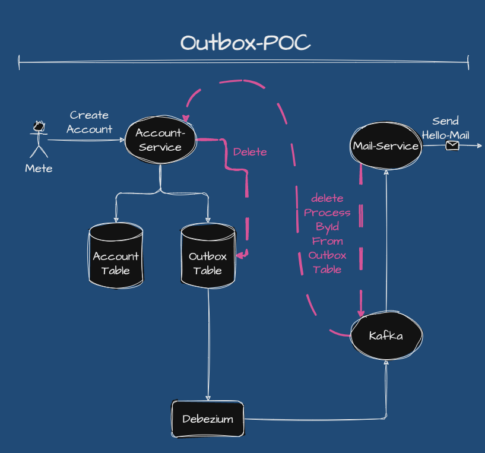
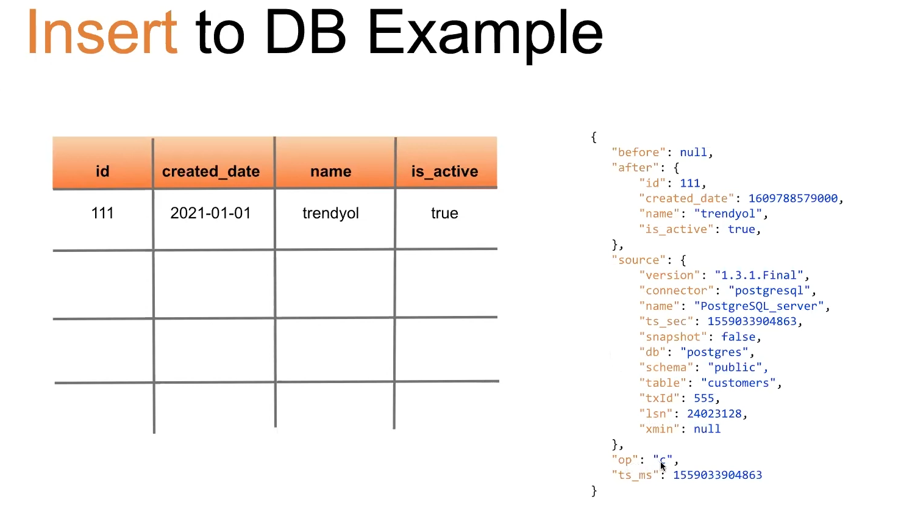
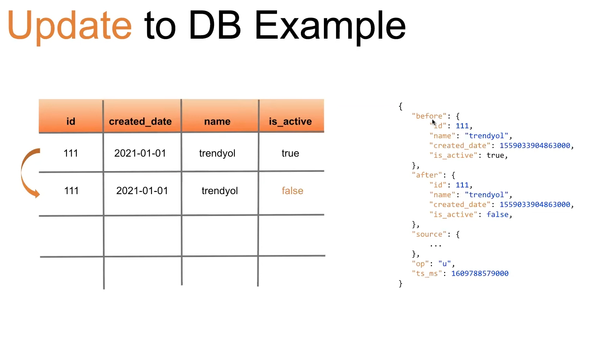

# outbox-poc

## Icerik

- [Outbox Design Pattern Nedir?](#outbox-design-pattern-nedir)
- [Diagram](#diagram)
- [Outbox Pattern'in Calisma Mantigi Nasil Isler](#outbox-patternin-calisma-mantigi-nasil-isler)
- [Outbox Pattern Hangi Durumlarda Kullanilir?](#outbox-pattern-hangi-durumlarda-kullanilir)
- [Outbox Pattern Zorluklari ve Cozumleri](#outbox-pattern-zorluklari-ve-cozumleri)
- [Ornek Senaryo](#ornek-senaryo)
- [Debezium nedir?](#debezium-nedir)
- [Debezium'in Bazi Temel Ozellikleri Sunlardir:](#debeziumin-bazi-temel-ozellikleri-sunlardir)
- [Docker Uzerinde Calistirmak Icin:](#docker-uzerinde-calistirmak-icin)
- [Tech Stack](#tech-stack)
- [Requirements](#requirements)
- [Build & Run](#build--run)
- [Kaynakca](#kaynakca)

## Outbox Design Pattern Nedir?

Outbox Design Pattern, dagitilmis sistemlerdeki veri tutarliligini ve guvenilirligi artirmak amaciyla kullanilan bir
tasarim desenidir. Bu desen, bir servisin yaptigi degisiklikleri (ornegin, bir veritabani guncellemesi) asenkron bir
sekilde diger servislere iletmek icin kullanilir. Temel mantigi, islem gerceklestiginde, ilgili bilgiler bir "outbox"
kaydinda saklanir ve daha sonra bu kayittaki bilgiler, bir mesaj kuyrugu veya olay akisi araciligiyla diger servislere
iletilir.
Bu sekilde, veri degisiklikleri guvenilir bir sekilde diger hizmetlere aktarilir ve veri tutarliligi saglanir. Outbox
tasarim deseni,
servislerin bagimsiz calismasini ve sistemlerin daha yuksek guvenilirlik seviyelerine ulasmasini destekler.

## Diagram

<p align="center">
    
</p>

## Outbox Pattern'in Calisma Mantigi Nasil Isler

- Bir veritabani islemi gerceklesir (ornegin, bir kayit eklenir veya guncellenir).
- Bu islem sonucunda bir olay (event) olusturulur veya temsil eden veriler hazirlanir.
- Olusturulan bu olay, ozel bir "outbox" tablosuna kaydedilir.
- Daha sonra bir baska surec veya sistem, outbox tablosundaki olaylari duzenli araliklarla kontrol eder.(Debezium)
- Outbox tablosundaki olaylar, asenkron bir sekilde bir olay akisina (event stream) gonderilir (ornegin, Kafka veya
  RabbitMQ gibi bir mesaj kuyrugu kullanilarak).
- Olay akisini dinleyen sistemler, bu olaylari alir ve isler.

## Outbox Pattern Hangi Durumlarda Kullanilir?

`1. Asenkron Islemler:` Ozellikle asenkron mesajlasma gerektiren uygulamalarda, Outbox pattern veritabani islemlerinin
sonuclarini asenkron olarak baska sistemlere veya servislere iletmek icin kullanilabilir. Bu, uygulamalar arasinda daha
iyi isbirligi ve performans saglar.
</br>
`2. Mikroservis Mimarileri:` Mikroservis mimarileri, bircok bagimsiz hizmetin bir araya geldigi karmasik uygulamalari
destekler. Outbox pattern, bu hizmetler arasinda veri butunlugunu ve tutarliligini korumak icin kullanilabilir.
</br>
`3. Event Sourcing:` Event Sourcing, uygulama durumunu olaylar (events) uzerinden takip eden bir tasarim yaklasimidir.
Outbox pattern, bu olaylarin baska sistemlere iletilmesi icin kullanilabilir.
</br>
`4. Guvenilir Iletisim:` Veritabani islemleri ve olaylarin guvenilir bir sekilde iletilmesi gereken durumlarda, Outbox
pattern kullanilabilir. Eger bir islem basarili bir sekilde tamamlandiysa, ancak olay gonderme islemi basarisiz olursa,
olay tekrar gonderilebilir veya geri alinabilir.
</br>
`5. Veri Tutarsizligi Onleme:` Outbox pattern, veritabani islemleri ve olay gonderme islemleri arasinda bagimsizligi
saglayarak, veri tutarsizligini onlemeye yardimci olur.
</br>
`6. Sistem Genislemesi:` Uygulamanizin buyumesi ve yeni bilesenlerin eklenmesi durumunda, Outbox pattern yeni
bilesenlerin veri akisini kolayca entegre etmenize yardimci olabilir.
</br>


<details>
<summary>Event Sourcing Ne Demek?</summary>
Event Sourcing, bir yazilim uygulamasinin durumunu ve verisini olaylar (events) uzerinden takip etmek ve bu olaylari bir 
kayit mekanizmasiyla saklamak icin kullanilan bir yazilim tasarim yaklasimidir. Geleneksel veritabani yontemlerinden farkli olarak,
Event Sourcing, tum uygulama durumu degisikliklerini olaylar olarak kaydeder ve bu olaylari kronolojik bir sira ile saklar.
</details>

## Outbox Pattern Zorluklari ve Cozumleri:

Outbox pattern, bircok avantaji olsa da bazi zorluklari da beraberinde getirebilir. Iste Outbox pattern kullanirken
karsilasilabilecek zorluklar ve bu zorluklari asmak icin onerilen cozumler:

`1. Islem Sirasi Sorunlari:` Veritabani islemi ve olayin gonderilmesi arasinda islem sirasi sorunlari olabilir.
Ornegin, olay gonderilmeden once veritabani islemi basarisiz olabilir. Bu durumda, islem geri alindiginda olayin
gonderilmesi gerekebilir.

**Cozum:** Islem sirasi sorunlarini ele almak icin "compensating transactions" veya "idempotent operations" gibi
teknikler kullanilabilir. Ayrica, islem sirasini duzenlemek ve asenkron islemleri koordine etmek icin bir is akis
yonetimi sistemi (workflow engine) kullanilabilir.

`2. Atilmis Olaylar:` Olaylarin gonderimi sirasinda hata olusursa, bazi olaylar atilabilir veya kaybedilebilir.

**Cozum:** Atilan olaylari yeniden gondermek icin bir yeniden deneme (retry) mekanizmasi kullanilabilir. Ayni olayin
birkac kez gonderilmesi problem yaratmaz cunku olaylarin idempotent olmasini saglayabilirsiniz.

`3. Performans Sorunlari:` Outbox pattern, her veritabani islemi icin bir olay gonderme islemi olusturdugundan, yuksek
veri islem hacimlerinde performans sorunlarina yol acabilir.

**Cozum:** Performansi artirmak icin islem sirasini ve olay gonderme sureclerini iyilestirmek gerekebilir. Ornegin,
olaylari toplu olarak gondermek veya asenkron islemleri daha iyi olceklendirmek icin teknikler kullanabilirsiniz.

`4. Olceklenebilirlik Zorluklari:` Outbox pattern'i kullanirken, artan is yukleri ve hizli buyume durumlarinda
olceklenebilirlik sorunlari ortaya cikabilir.

**Cozum:** Olceklenebilirlik sorunlarini ele almak icin bulut tabanli hizmetler veya kumeler (clusters)
kullanabilirsiniz. Ayrica, yuk dengeleme ve otomatik olceklendirme gibi teknikleri uygulayarak sistemlerinizi
olceklendirebilirsiniz.

`5. Dis Sistemle Entegrasyon Zorluklari:` Olaylari dis sistemlere iletmek ve dis sistemlerden cevap almak bazen
karmasik olabilir.

**Cozum:** Dis sistemle entegrasyonu basitlestirmek icin API tasarimi ve iletisim protokolleri uzerinde dikkatli
calismak onemlidir. Ayrica, dis sistemlerden gelebilecek hatalara karsi guclu hata yonetimi ve geri alma stratejileri
olusturmalisiniz.

## Ornek Senaryo:

E-ticaret stok yonetimi icin Outbox pattern kullanimi su sekilde orneklenir:

Bir e-ticaret platformunda, urun stoklari guncellendiginde (ornegin, yeni bir urun geldiginde veya bir urunun stok
miktari arttiginda), bu guncellemelerin tum sistemler ve musterilere guvenilir bir sekilde iletilmesi gerekebilir. Stok
guncellemeleri onemlidir cunku musterilerin urunlerin mevcutlugunu ve teslimat suresini bilmesi gerekir.

Outbox pattern kullanarak bu senaryoyu ele alabilirsiniz:

1. Bir stok guncellemesi gerceklestiginde (ornegin, yeni bir urun alindiginda veya mevcut bir urunun stok miktari
   arttiginda), bu guncellemeyi bir "stok guncelleme" olayi olarak belirleyebilirsiniz.

2. Bu stok guncelleme olayini bir "outbox" tablosuna ekleyin. Outbox tablosu, stok guncellemelerini temsil eden tum
   olaylari icerir.

3. Bir Outbox Consumer adi verilen bir sistem, duzenli araliklarla outbox tablosunu kontrol eder ve yeni stok guncelleme
   olaylarini alir.

4. Bu alinan olaylari, ornegin Kafka gibi bir olay akisi sistemine gondererek asenkron bir sekilde diger sistemlere
   iletebilirsiniz.

5. Diger sistemler, bu olaylari alir ve stok guncellemelerini guncellemek veya musterilere bildirmek icin kullanabilir.

Bu yaklasim, e-ticaret platformunun stok guncellemelerini musterilere ve diger sistemlere guvenilir bir sekilde
iletebilmesini saglar. Ayrica, veritabani islemleri ve olay gonderme islemleri arasinda bagimsizlik saglar ve veri
butunlugunu korur.

## Debezium nedir?

Debezium, bircok veritabani sistemini izlemek ve bu veritabanlarindaki degisiklikleri gercek zamanli olarak yakalamak
icin kullanilan acik kaynakli bir CDC (Change Data Capture - Veri Degisikliklerini Yakalama) platformudur. Debezium,
veritabanlarindaki degisiklikleri bir dizi olay (event) olarak yakalar ve bu olaylari bir olay akisi (event stream)
olarak cesitli hedeflere iletebilir. Bu, veritabanlarindaki degisiklikleri izlemek ve bu degisiklikleri diger sistemlere
entegre etmek icin oldukca guclu bir arac saglar.

## Debezium'in Bazi Temel Ozellikleri Sunlardir:

- Gercek Zamanli Izleme
- Degisiklikleri Isleme ve Donusturme
- Entegrasyon Kolayligi
- Veritabani Bagimsizligi

<p align="center">
    
</p>

<p align="center">
    
</p>

## Docker Uzerinde Calistirmak Icin:

Docker uzerinden calistirmak icin docker-compose.yml dosyasini kullanabilirsiniz.

```dockerfile
version: '3'
services:

  # Kafka hizmeti, Kafka sunucusunu baslatir.
  kafka:
    image: confluentinc/cp-kafka:latest
    container_name: kafka-broker
    depends_on:
      - zookeeper  # Kafka'nin calisabilmesi icin ZooKeeper hizmetine baglidir.
    ports:
      - 59092:59092  # Kafka'ya disaridan erisim saglar.
    environment:
      KAFKA_BROKER_ID: 1
      KAFKA_ZOOKEEPER_CONNECT: zookeeper:2181  # Kafka'nin ZooKeeper ile iletisim kurmasini saglar.
      KAFKA_ADVERTISED_LISTENERS: PLAINTEXT://kafka:9092,PLAINTEXT_HOST://localhost:59092
      KAFKA_LISTENER_SECURITY_PROTOCOL_MAP: PLAINTEXT:PLAINTEXT,PLAINTEXT_HOST:PLAINTEXT
      KAFKA_INTER_BROKER_LISTENER_NAME: PLAINTEXT
      KAFKA_OFFSETS_TOPIC_REPLICATION_FACTOR: 1  # Offset konularinin cogaltma faktorunu ayarlar.

  # ZooKeeper hizmeti, Kafka icin koordinasyon ve konfigurasyon depolama saglar.
  zookeeper:
    image: confluentinc/cp-zookeeper:latest
    container_name: zookeeper
    environment:
      ZOOKEEPER_CLIENT_PORT: 2181
      ZOOKEEPER_TICK_TIME: 2000
      ZK_SERVER_HEAP: "-Xmx256M -Xms256M"  # ZooKeeper'in bellek yapilandirmalarini belirler.
    ports:
      - 52181:2181  # ZooKeeper'a disaridan erisim saglar.

  # Kafka Connect hizmeti, Kafka veri akislarini kaydetmek ve islemek icin kullanilir.
  kafka_connect:
    container_name: kafka_connect
    image: debezium/connect
    links:
      - db
      - kafka
    ports:
      - '8083:8083'  # Kafka Connect REST API'ya disaridan erisim saglar.
    environment:
      - BOOTSTRAP_SERVERS=kafka:9092  # Kafka sunucusuna baglanma ayarlarini tanimlar.
      - GROUP_ID=medium_debezium
      - CONFIG_STORAGE_TOPIC=my_connect_configs
      - OFFSET_STORAGE_TOPIC=my_connect_offsets
      - STATUS_STORAGE_TOPIC=my_connect_statuses

  # Kafka UI hizmeti, Kafka kumesini izlemek ve yonetmek icin bir kullanici arayuzu saglar.
  kafka-ui:
    container_name: kafka-ui
    image: provectuslabs/kafka-ui:latest
    ports:
      - "9091:8080"  # Kafka UI'ya disaridan erisim saglar.
    restart: always
    depends_on:
      - kafka
      - zookeeper
    environment:
      - KAFKA_CLUSTERS_0_NAME=local
      - KAFKA_CLUSTERS_0_BOOTSTRAPSERVERS=kafka:9092
      - KAFKA_CLUSTERS_0_ZOOKEEPER=zookeeper:2181

  # Veritabani hizmeti, ornek bir PostgreSQL veritabanini baslatir.
  db:
    image: debezium/example-postgres
    restart: always
    environment:
      POSTGRES_USER: postgres
      POSTGRES_PASSWORD: toor
    ports:
      - 5432:5432  # PostgreSQL veritabanina disaridan erisim saglar.
    extra_hosts:
      - "host.docker.internal:host-gateway"
    command:
      - "postgres"
      - "-c"
      - "wal_level=logical"
    volumes:
      - ./init.sql:/docker-entrypoint-initdb.d/create-db-tables.sql  # Ilk veritabani tablolarini olusturan SQL dosyasini yukler.

  # Adminer hizmeti, veritabani yonetim arayuzu saglar.
  adminer:
    image: adminer
    restart: always
    ports:
      - 8001:8080  # Adminer'a disaridan erisim saglar.
```

## Tech Stack

- Java 17
- Spring Boot 3.0
- Spring Data JPA
- Kafka
- Debezium
- PostgreSQL
- Docker
- Lombok

## Requirements

For building and running the application you need:

- [JDK 17 or newer](https://www.oracle.com/java/technologies/javase-downloads.html)
- [Maven](https://maven.apache.org)
- [Kafka](https://kafka.apache.org/)
- [Debezium](https://debezium.io/)
- [PostgreSQL](https://www.postgresql.org/)
- [Lombok](https://projectlombok.org/)
- [Docker](https://www.docker.com/)

## Build & Run

```shell
  docker-compose -f docker-compose.yml up -d
```

```shell
  mvn clean install && mvn --projects backend spring-boot:run
```

## Kaynakca
- https://youtu.be/R4Qbngs_tKw?si=fhHtuj2cw0edS0Cj
- https://github.com/tugayesilyurt/spring-debezium-kafka-mysql-redis-cacheable
- https://youtu.be/pC-SY81n0sw?si=AtPSoLOB91VTTTQq
- https://youtu.be/D6sIzOt7ONA?si=lZ7xT7r84cEd1vFZ
- https://medium.com/@egorponomarev/outbox-pattern-in-spring-boot-8e8cf116f044
- https://medium.com/cstech/transactional-outbox-pattern-neden-ve-nasil-fbead861e3c0
- https://www.linkedin.com/pulse/microservice-architecture-outbox-pattern-hugo-tota/